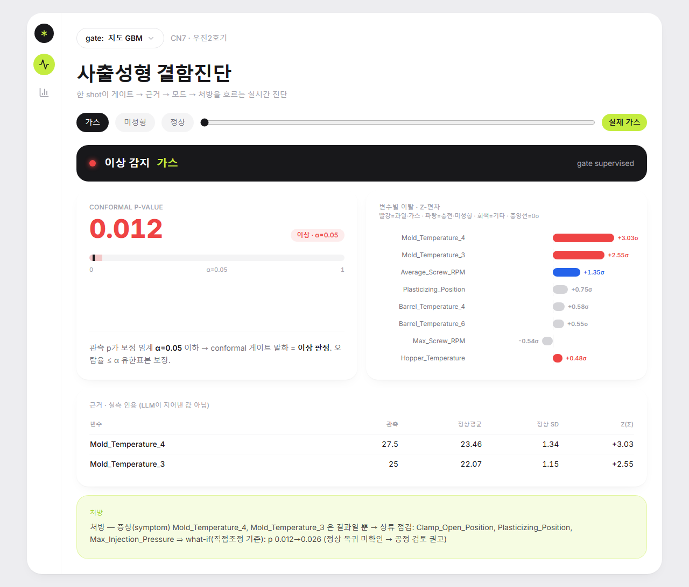
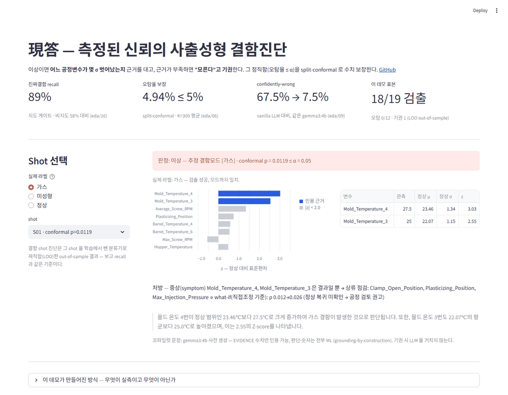
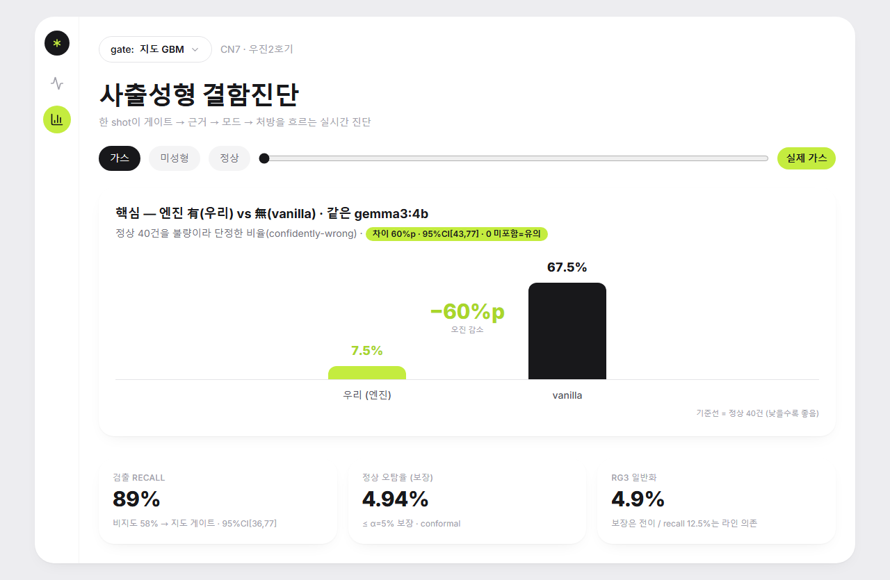

# 現答 (현답) — 측정된 신뢰의 제조 AX 코파일럿

> 사출성형 현장에서 "이 제품이 왜 불량인가"를 물으면, **데이터에 근거해서만** 답하고
> 모르면 **"모른다"**고 하며, 그 정직함을 **숫자로 증명**하는 결함진단 copilot.



> *지도 게이트가 가스 결함을 진단: conformal **p=0.012**(LOO out-of-sample), 금형온도 **+3σ** 근거 인용,
> "증상→상류 점검" 처방. 판단·숫자는 ML이, LLM은 표현만 — 못 잡으면 "모른다".*

**라이브 데모** — `demo/` (Streamlit): 진짜결함 19개 + held-out 정상 12개를 LOO out-of-sample
파생값으로 재생한다. 검출·기권·근거 인용을 직접 눌러볼 수 있다 (KAMP 원본 데이터·LLM 미포함,
사전계산 방식은 [demo/README.md](demo/README.md)).
로컬 실행: `pip install -r demo/requirements.txt && streamlit run demo/app.py`



---

## 1. 왜 — AX의 진짜 실패 지점

제조 AX의 약속은 "공장 업무를 AI로 지능화한다"이다. 그런데 대부분의 파일럿은 모델 정확도가 아니라
**신뢰**에서 멈춘다. 현장은 *그럴듯하게 틀린* AI를 안 쓴다 — 틀린 이유를 자신만만하게 대면 한 번 데이고 영영 안 쓴다.

거대기업(MS·Bosch·Siemens)·국내 SI는 다 **통합·오케스트레이션**으로 경쟁한다. 하지만 **아무도
"이 AI가 거짓말하는지"를 측정하지 않는다.** 거기가 빈자리다.

**現答의 한 줄:** 통합이 아니라 **측정된 신뢰(measured trust)**로 승부한다.

## 2. 무엇 — 한 shot이 흐르는 길

```
입력: 공정변수 24개
  │
  ▼ [검출]  conformal 게이트 — 이상? 모른다?   (Mahalanobis 거리 + split-conformal)
  │           p>α → "모른다"(끝, LLM 안 거침)
  ▼ [설명]  detector — 어느 변수가 몇 σ 벗어났나 + 결함모드   (z-편차 + 도메인 시그니처)
  ▼ [표현]  copilot — evidence 수치만 한국어로   (gemma3:4b, 판단 아님 = 통역)
  ▼ [처방]  prescribe — lever 조정 / 증상이면 상류 점검 + what-if 검증   (recourse + 인과)
```

**핵심 원리 — grounding-by-construction:** 판단·숫자는 전부 머신러닝(결정론)이 하고, LLM은 *계산된
evidence를 표현만* 한다. 숫자를 지어낼 통로가 없다. 못 잡으면 LLM 없이 결정론적 "모른다".

## 3. 가치 사다리 — 어디까지, 그리고 각 칸의 한계

```
서술 → [진단 ✅] → [처방 ✅] → [인과 ✅robust] → [예측 ✅] → 자율
```
사다리를 오를수록 confidently-wrong의 비용이 폭발한다(진단=1분 / 처방=스크랩 / 자율=설비사고).
그래서 **각 칸에서 "할 수 있는 것 + 한계"를 정직하게 긋는다** — 이게 통합 경쟁자들이 안 하는 부분.

| 칸 | 성과 | 정직한 한계 |
|---|---|---|
| **진단** | 모드 적중 82%, recall **58→89%**(지도 게이트), 오탐율 ≤5% **보장** | z<1σ 결함 불검출, 지도는 라벨 필요 |
| **처방** | lever 직접조정 + 방향 권고 | 단순 수정 미확인 시 "공정 검토"(자동수리 사칭 X) |
| **인과** | 증상 식별(금형온도)→상류 점검 안내 | 관측 단일라인 인과탐색 천장, 아티팩트는 도메인 override |
| **예측** | 드리프트 lead-time 74~146 shot, 오경보율 **≤1% 보장** | 약한(1σ) 드리프트 천장, 참조 in-control은 가정 |

## 4. 결과 (전부 실데이터 검증, `outputs/`)

**데이터:** KAMP 사출성형 — 실제 현대 CN7 부품(650톤 우진2호기). 라벨 6,736 shot 중 불량 39
(진짜 공정결함 = 가스 13 + 미성형 6 = **19개, 0.28%**. 초기허용불량 20은 cold-start라 제외). 무라벨 35,239.

**검출:** split-conformal 게이트 — K=300 split 평균 오탐율 **α=0.05 → 4.94% ≤ 5%**(보장 성립).
진짜결함 recall **58%**(비지도). **지도 GBM 게이트로 교체 시 recall 58→89%**(오탐율 4.6%≤5% 보장 유지, LOO 교차적합, eda/16) —
conformal 보장이 검출기 무관이라 가능. 17/19 검출, 못 잡은 2개는 z<1σ "데이터에 흔적 없는" 결함(모델 한계 아닌 데이터 한계).

**정직성 — 엔진 有(우리) vs 無(vanilla), 같은 gemma3:4b:**

| | 우리 | vanilla |
|---|---|---|
| 진짜결함 19 모드 | 정답 9 / **기권 8** / 오답 2 | 정답 2 / 기권 0 / 오답 17 |
| 정상 40건 confidently-wrong | **8%** (α보장) | **68%** |

→ vanilla는 정상 제품의 68%를 불량 단정, 진짜결함 17/19 오진(정상 baseline을 모름). 우리는 모르면 기권.



> *대시보드 "측정된 신뢰" 탭: 같은 gemma3:4b를 엔진 有(우리 7.5%) vs 無(vanilla 67.5%)로만 가른 confidently-wrong 대조.*

**신뢰구간 (eda/14, 양성 19개라 정직하게):** 검출 recall 57.9% **95%CI [36.3, 76.9]**(부트스트랩 5000회 [36.8, 78.9] 일치)
— 점추정 과신 금지. 반면 핵심 주장인 **vanilla 대비 CW 감소 60%p는 95%CI [43, 77]p로 0을 안 포함 = 통계적으로 유의.**
즉 "어디는 불확실(recall)·어디는 견고(CW 차이)"를 분리 보고 — measured-trust 브랜드 그대로.

**처방·인과 (실제 출력):**
```
[가스]   금형온도는 증상 → 상류 점검: Clamp_Open_Position, Plasticizing_Position, 사출압
[미성형] 직접 조정(lever): Max_Injection_Speed 60.7→55.55 | what-if p 0.001→0.006 (미확인 → 공정 검토)
```

**예측 — conformal test martingale 드리프트 조기경보 (`src/drift.py`, eda/13):** 검출 칸의 conformal
p-value 스트림을 Simple Jumper 마틴게일에 흘림. Ville 부등식으로 **오경보율 ≤ 1/c 보장**(c=100 → ≤1%).
교환가능 정상 스트림 검증 = 오경보율 0.7% ≤ 1%(보장 성립). 금형온도 점진 shift 주입 → **lead-time 74~146 shot,
onset 전 헛경보 0**. 실 생산 35K 스트림(자기일관 감시)에서도 측정 가능한 드리프트 실재 확인.

**일반화 검증 — 두 번째 실데이터 RG3 (`eda/15`, 같은 650톤 기계·다른 부품, 진짜결함 32):** 정직한 혼합 결과 —
**보장은 전이(✅** RG3 오탐율 4.9%≤5%, conformal 분포가정無), **검출력은 라인 의존(❌** recall 12.5% vs 58%;
RG3 결함이 공정변수상 max ~1σ로 거의 안 보임), **시그니처는 부품 특수적(❌** RG3 가스는 금형온도 무관). →
"약한 순환성" 한계가 실데이터로 확인 = 라인별 재학습 필요. **일반화를 가정 않고 측정** = "단일공정 depth" 전략의 실증 근거.

**측정해서 떨군 것(negative result):** ECOD(PyOD) vs Mahalanobis = 사실상 동률(58% vs 53%, 19개 중 1개차).
ECOD는 변수독립 가정이라 상관된 다변량 결함에 불리 → **Mahalanobis 유지.** (추천 기법도 검증 후 채택)

## 5. 머신러닝 스택

| 용도 | 기법 | 비고 |
|---|---|---|
| 검출 | **지도 GBM 게이트**(불량확률 score) + Mahalanobis fallback | conformal 보장은 score 무관 → 라벨 있으면 recall 58→89% (eda/16) |
| 게이트 | **Split Conformal Prediction** | 분포가정 없이 오탐율 ≤α 보장, 검출기 무관 |
| 설명 | z-편차 + 시그니처 \|z\|가중 투표 | 변수 단위 근거 |
| 인과 | **DirectLiNGAM** (robust 부분만) | lever vs symptom |
| 예측 | **Conformal Test Martingale** (Simple Jumper) | Ville 부등식으로 오경보율 ≤1/c 보장 |
| 표현 | gemma3:4b (Ollama) | 판단 아님 — 교체 가능한 통역 |
| 베이스라인 | PCA-AE · 지도 LR · ECOD | 비교용, 파이프라인엔 미채택 |

## 6. 구조

```
molding-copilot/
├── README.md / worklog.md(진실의 원천)
├── src/   conformal · detector · grounding · copilot · vanilla · prescribe · causal · drift  (8모듈 ~350줄)
├── eda/   01_inventory → 18_demo_loo (재현 스크립트 18종)
├── webapp/(Django REST) · frontend/(React+TS 대시보드)
├── outputs/  텍스트 18 + figures/(hist·scatter·pca·anomaly_scores·drift_martingale)
└── data/Dataset_Molding/   ← KAMP 데이터, repo 미포함(.gitignore) · 위 "데이터 출처" 참고
```

## 7. 로드맵 — 두 확장 축

- **세로 (가치 사다리):** 진단 → 처방 → 인과(robust) → 예측(드리프트 조기경보 ✅) → **bounded 자율**
  (conformal 게이트가 곧 "사람 에스컬레이션" 메커니즘)
- **가로 (제조 플로우 스위트):** **④검사(현재)** → ③가동(예지보전) → ②셋업(공정조건) → ①계획(수주예측).
  같은 "측정된 신뢰" 척추를 Land-and-Expand.

## 8. 정직한 한계
- 진짜결함 19개뿐 → 지표 분산 큼: recall 58% **95%CI [36, 77]**(eda/14). 검출 천장 존재. 점추정 과신 금지.
- 도메인 시그니처가 데이터 분리도에서 유래 → 약한 순환성. **RG3 실데이터 검증서 시그니처 부품 특수성 확인(eda/15) = 라인별 재유도 필요.**
- 관측 단일라인 인과탐색은 천장 — 신뢰 lever엔 도메인 prior/개입 데이터 필요. (자율 함부로 약속 안 함)
- 지도 게이트는 라벨된 결함모드만 강함 → 처음 보는 결함엔 Mahalanobis 안전망 필요. 단 고정 FPR 예산서
  known recall vs novel coverage는 경합(eda/17): 안전망은 '공짜'가 아니라 운영자가 정하는 다이얼. 점수 블렌딩은 역효과.

## 데이터 출처 · 재현 (⚠️ 데이터는 이 repo에 포함하지 않음)

- **출처:** [KAMP — 인공지능 제조 플랫폼](https://www.kamp-ai.kr/) 의 **사출성형 제조AI데이터셋**.
  중소벤처기업부 주관, KAIST 운영(문의 `kamp@kaist.ac.kr`). 실제 현대 CN7 부품 · 650톤 우진2호기.
- **라이선스/주의:** 무료 **회원가입 후** 다운로드. KAMP로 만든 AI 모델의 상업적 활용은 허용되나,
  **원본 데이터셋 자체의 재배포는 제한**된다(정확한 약관은 KAMP 포털 확인). → 그래서 본 repo는
  **원본 데이터를 포함하지 않는다**(`.gitignore` 의 `data/`, ~256MB). 재현하려면 각자 KAMP에서 직접 받아야 한다.
- **재현 절차:**
  1. www.kamp-ai.kr 회원가입 → "사출성형 제조AI데이터셋" 다운로드.
  2. CSV들을 `data/Dataset_Molding/dataset/` 에 배치(`labeled_data.csv`, `moldset_unlabeled_cn7.csv`, `supervised_label_cn7.csv` 등).
  3. `python eda/01_*.py … 18_*.py` 로 `outputs/` 재생성, 또는 아래 웹앱 기동.

## 환경
Python 3.13.7 / pandas · scikit-learn · lingam · pyod / Ollama(gemma3:4b, 로컬·무료).
재현: **먼저 데이터 준비**(위 "데이터 출처 · 재현") → `python eda/0X_*.py` (각 스크립트가 `outputs/`에 결과 생성)
**웹앱 (Django + TypeScript, 권장):** `src/` 파이프라인을 Django REST API로 노출 + React/TS SPA 대시보드.
```
cd webapp && python manage.py runserver       # 백엔드 :8000 (DRF, service 레이어, camelCase)
cd frontend && npm install && npm run dev      # 프론트 :5173 (점유 시 자동 5174) · Vite 프록시 /api→8000
```
한 shot이 게이트→근거→모드→처방을 흐르는 실시간 진단 + 지도/비지도 게이트 토글 + "측정된 신뢰" 탭.
**정직성:** 지도 모드로 데모 결함을 진단할 땐 그 shot을 학습에서 뺀 분류기로 재적합(LOO 교차적합, eda/18) — 대시보드 진단도
in-sample이 아닌 out-of-sample(보고 recall과 같은 기준). 데모 LOO 검출 18/19는 정상 split 차이로 eda/16 보고 17/19(89%)와 1개 차(19표본 분산 범위).
디자인: 라이트 + 라임 액센트 + 라운드 카드 + 아이콘 레일 (레퍼런스: 모던 헬스 대시보드 + Vercel). 차트는 CSS/SVG 자체 구현.
